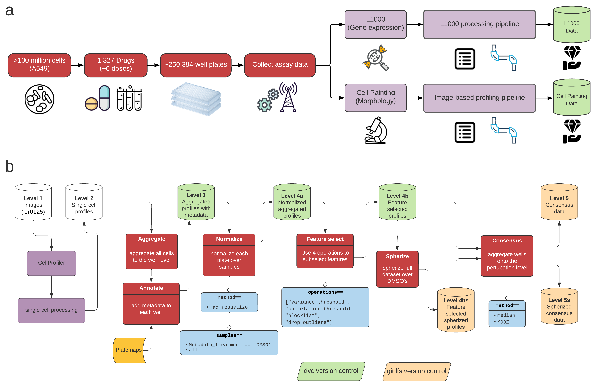

# Morphology and gene expression profiling provide complementary information for mapping cell state

[](https://zenodo.org/badge/latestdoi/300036005)

Assessing information contained in different profiling data modalities.

## Assays

We evaluated two assays:

* L1000 (gene expression)
* Cell Painting (morphology)

## Perturbations

We tested each assay in their ability to measure cell states from 1,327 compound perturbations across 6 doses (0.04µM, 0.12µM, 0.37µM, 1.11µM, 3.33µM, and 10µM) from the Drug Repurposing Hub.

## Evaluations

We evaluated the two assays in several tasks:

- Reproducibility
- Sample diversity
- Feature diversity
- MOA prediction (unsupervised)
- Gene target prediction (unsupervised)
- MOA prediction (supervised)
- Gene Ontology pathway prediction (supervised)

## Data collection and data processing procedures


> Data collection and data processing workflows, related to Figure 1.
(a) We cultured A549 lung cancer cells and exposed them to 1,327 different compound perturbations in about six doses per compound.
We plated these cells in 384 well plates, and, using the same plate layout, measured gene expression (using the L1000 assay) and morphology (using the Cell Painting assay) in compound-perturbed A549 cells.
(b) Our image-based profiling pipeline we used to process the Cell Painting images.
We used pycytominer to process the single cell profiles.
All processing code and profile data are available at https://github.com/broadinstitute/lincs-cell-painting. Image data available at Image Data Resource (accession: idr0125).

## Findings summary

We find that each assay provides complementary information for mapping cell state.
Cell Painting has generally higher reproducibility, but suffers from more technical artifacts.
L1000 has a more diverse feature space, but contains less diverse samples.
In general Cell Painting captures more MOAs by an unsupervised analysis, but L1000 performs better in deep learning predictions.

**Importantly, each assay captures complementary cell states.**
By combining each data type, one can capture more mechanisms than either alone.

See our paper (linked below) for more details and extensive resources.

## Reproduce computational environment

We use a combination of conda and pip to manage the proper python packages for data assessment and model predictions.
To reproduce our environment run the following:

```bash
# In the top folder of the directory
conda env create --force --file environment.yml && conda activate lincs-complimentarity && cd 2.MOA-prediction/ && python setup.py && cd ..
```

We also need to setup custom computational environments for tensorflow and pytorch for the MOA prediction analysis.

```bash
# Navigate into the MOA prediction folder
cd 2.MOA-prediction

# Step 1 - Tensorflow
# Initialize a virtual environment
python3 -m venv tensorflow_env

# Activate the environment
source tensorflow_env/bin/activate

# Upgrade pip if necessary
# python3 -m pip install --upgrade pip

# Install tensorflow requirements
python3 -m pip install -r tensorflow_requirements.txt

# Step 2 - Pytorch
python3 -m venv pytorch_env
source pytorch_env/bin/activate
python3 -m pip install -r pytorch_requirements.txt && python3 setup.py
```

## Citation

For a complete discussion of our findings please view our preprint:

> Morphology and gene expression profiling provide complementary information for mapping cell state.
Gregory P. Way, Ted Natoli, Adeniyi Adeboye, Lev Litichevskiy, Andrew Yang, Xiaodong Lu, Juan C. Caicedo, Beth A. Cimini, Kyle Karhohs, David J. Logan, Mohammad Rohban, Maria Kost-Alimova, Kate Hartland, Michael Bornholdt, Niranj Chandrasekaran, Marzieh Haghighi, Shantanu Singh, Aravind Subramanian, Anne E. Carpenter. bioRxiv 2021.10.21.465335; doi: https://doi.org/10.1101/2021.10.21.465335 
